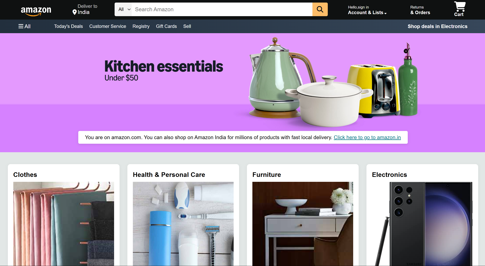

# Amazon Clone Project

A responsive front-end recreation of Amazon's homepage built with HTML5 and CSS3, featuring modern design patterns and smooth animations.


## 📸 Screenshots

### Desktop View



## 🌟 Features

### Navigation & Header
- **Responsive Navigation Bar** with Amazon logo, location selector, and search functionality
- **Interactive Search Bar** with category dropdown and magnifying glass icon
- **User Account Section** with sign-in prompt and account management links
- **Shopping Cart Icon** with hover effects
- **Secondary Navigation Panel** with deals, customer service, and category links

### Hero Section
- **Dynamic Hero Banner** with background image and promotional messaging
- **Call-to-Action** directing users to Amazon India with smooth transitions
- **Fade-in Animation** for enhanced user experience

### Product Categories
- **8 Product Category Cards** including:
  - Clothes
  - Health & Personal Care
  - Furniture
  - Electronics
  - Beauty Picks
  - Pet Care
  - New Arrival & Toys
  - Discover Fashion Trends
- **Hover Effects** with card elevation and image scaling
- **Responsive Grid Layout** that adapts to different screen sizes

### Footer
- **Multi-Panel Footer** with comprehensive site information
- **Link Categories** including "Get To Know Us", "Make Money with Us", "Payment Products", and "Help"
- **Back to Top** functionality
- **Copyright and Legal Links**

## 🛠️ Technologies Used

- **HTML5**: Semantic markup and structure
- **CSS3**: Modern styling with flexbox and animations
- **Font Awesome**: Icons and visual elements


## 🎨 Design Highlights

### Visual Design
- **Amazon Brand Colors**: Authentic color scheme with `#0F1111` primary and `#febd68` accent
- **Clean Typography**: Arial font family for consistency with Amazon's branding
- **Professional Layout**: Properly spaced sections with intuitive navigation

### Interactive Elements
- **Smooth Hover Transitions**: 0.3s ease transitions on interactive elements
- **Border Animations**: Dynamic borders on navigation items
- **Card Hover Effects**: Elevation and scaling effects on product category cards
- **Color Transitions**: Accent color changes on hover states


## 📁 Project Structure

```

Amazon/
├── index.html                    # Main HTML structure
├── style.css                     # Comprehensive styling  
├── README.md                     # Project documentation
├── assets/                       # All project assets
│   └── images/
│       ├── logo/
│       │   └── amazon_logo.png   # Amazon logo asset
│       ├── hero/
│       │   └── hero_image.jpg    # Hero section background
│       └── categories/           # Product category images
│           ├── clothes.jpg       # Clothes category
│           ├── health-care.jpg   # Health & Personal Care
│           ├── furniture.jpg     # Furniture
│           ├── electronics.jpg   # Electronics
│           ├── beauty.jpg        # Beauty Picks
│           ├── pet-care.jpg      # Pet Care
│           ├── toys.jpg          # New Arrivals & Toys
│           └── fashion.jpg       # Fashion Trends
└── screenshots/
    └── desktop-view.png          # Project screenshot

```

## 🚀 Quick Start

### Prerequisites
- Modern web browser (Chrome, Firefox, Safari, Edge)
- Text editor (optional, for modifications)

### Installation

1. **Clone the repository**
   ```bash
   git clone https://github.com/mayank-kumar214/amazon-homepage-clone.git
   cd amazon-clone
   ```

2. **Open in browser**
   ```bash
   # Simply open the index.html file in your browser
   open index.html  # macOS
   start index.html # Windows
   ```

3. **No build process required** - pure HTML/CSS implementation!

## 📱 Responsive Behavior

### Desktop (>768px)
- Full 4-column product grid
- Complete navigation with all elements visible
- Optimized for large screens with proper spacing

## 🎯 Key Learning Outcomes

- **CSS Flexbox & Grid**: Modern layout techniques
- **Responsive Design**: Mobile-first development approach
- **CSS Animations**: Smooth transitions and hover effects
- **Component Architecture**: Modular CSS organization
- **Brand Recreation**: Attention to design details and user experience

## 🔧 Technical Implementation

### CSS Architecture
- **CSS Variables**: Consistent color scheme management using `:root`
- **Flexbox Layout**: Modern layout techniques for responsive design
- **CSS Animations**: Smooth transitions and hover effects with `@keyframes`
- **Media Queries**: Responsive design implementation
- **Component-Based**: Organized CSS with logical section separation

### Performance Features
- **Efficient CSS**: Organized with CSS variables and minimal redundancy
- **CDN Resources**: Fast loading of Font Awesome icons
- **Optimized Images**: Background images for quick loading
- **Hardware Acceleration**: Transform-based animations for smooth performance

## 📋 Browser Support

- ✅ **Chrome** (recommended)
- ✅ **Firefox**
- ✅ **Safari**
- ✅ **Edge**
- ✅ **Mobile browsers** (iOS Safari, Chrome Mobile)

## 🚀 Future Enhancements

### Phase 1 - JavaScript Integration
- [ ] Interactive search functionality
- [ ] Shopping cart add/remove logic
- [ ] User authentication UI
- [ ] Product filtering and sorting

### Phase 2 - Advanced Features
- [ ] Product detail pages
- [ ] Checkout process
- [ ] User reviews and ratings
- [ ] Wishlist functionality

### Phase 3 - Technical Upgrades
- [ ] React.js conversion
- [ ] Backend API integration
- [ ] Progressive Web App features
- [ ] Performance optimization with lazy loading

## 🤝 Contributing

Contributions, issues, and feature requests are welcome!

1. **Fork the Project**
2. **Create your Feature Branch** (`git checkout -b feature/AmazingFeature`)
3. **Commit your Changes** (`git commit -m 'Add some AmazingFeature'`)
4. **Push to the Branch** (`git push origin feature/AmazingFeature`)
5. **Open a Pull Request**

## 👨‍💻 Author

**Your Name**
- GitHub: [mayank-kumar214](https://github.com/mayank-kumar214)
- LinkedIn: [mayankconnects](https://linkedin.com/in/mayankconnects)
- Email: iammayank214@gmail.com

## 📄 License

This project is for educational purposes only. Amazon's trademarks and design elements are used for demonstration purposes under fair use guidelines.

## 🙏 Acknowledgments

- **Amazon.com** for design inspiration
- **Font Awesome** for beautiful icons
- **MDN Web Docs** for CSS reference


---

⭐ **Star this repo if you found it helpful!** ⭐

*Built with ❤️ as a front-end development learning project*
